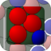
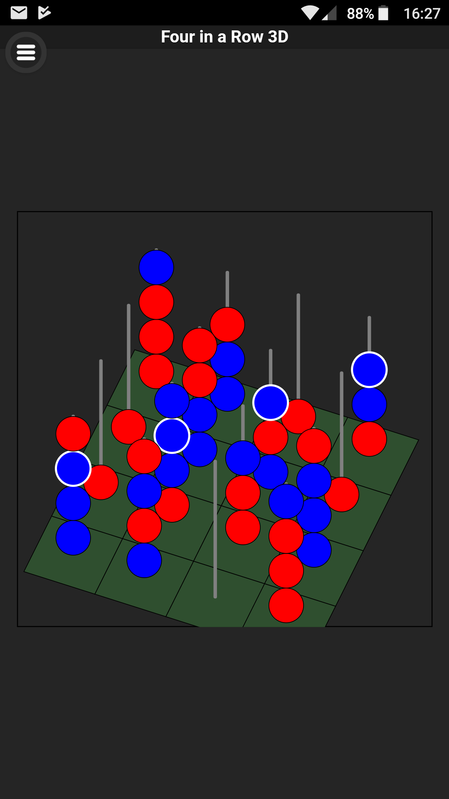
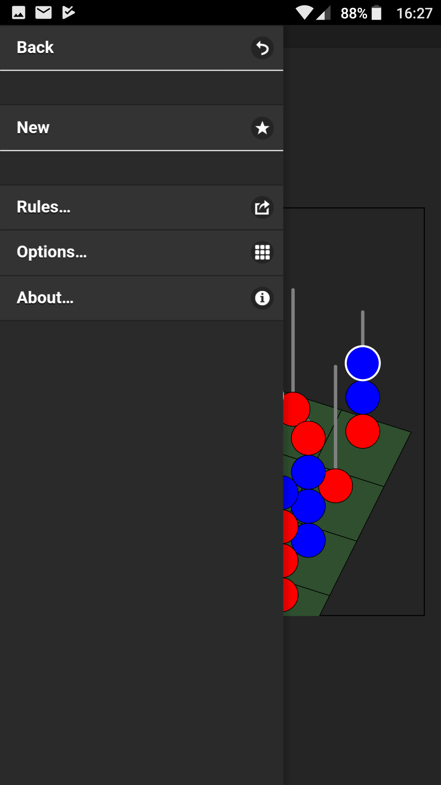
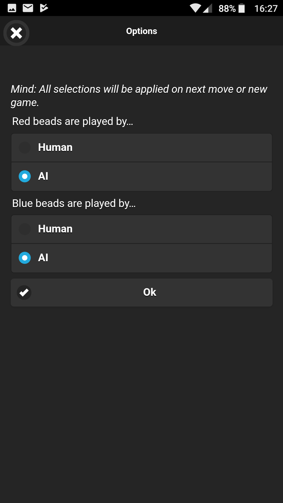
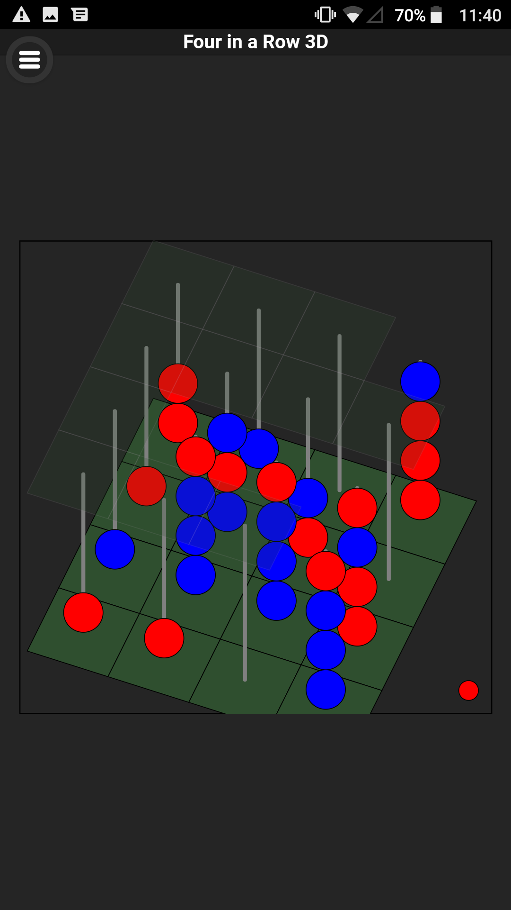
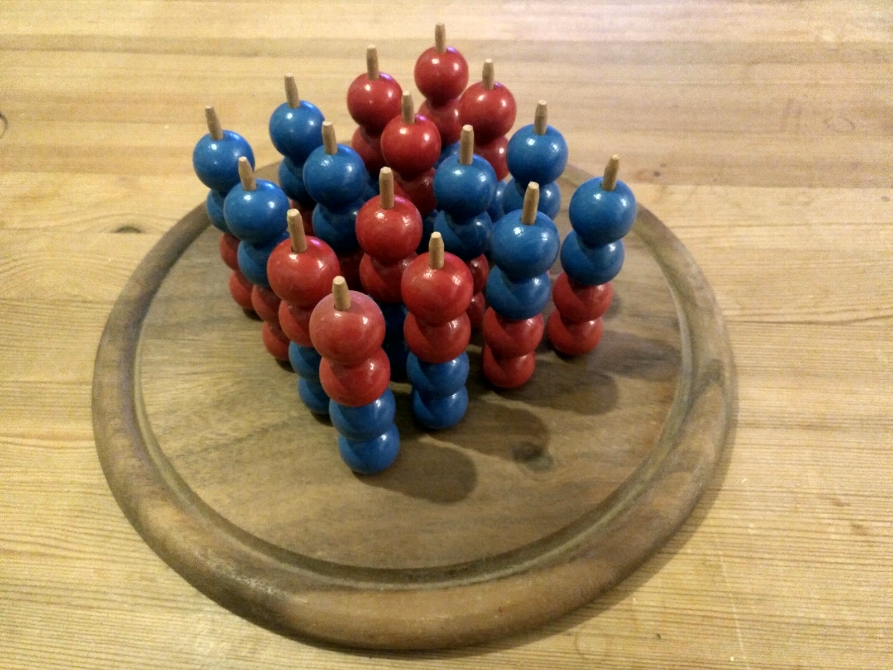
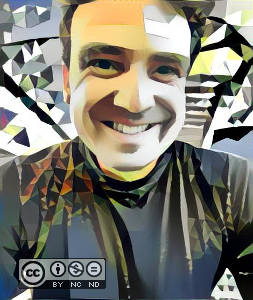

 Four in a Row 3D
=============

3 dimensional Four in a Row game with computer AI using Monte Carlo Tree Search (MCTS) with UCB (Upper Confidence Bounds) applied to trees (UCT in short).

* <em>Start a session in browser on http://omerkel.github.io/FourInARow3D/html5/src/ </em>
* <em>Android APK available for install</em>  https://github.com/OMerkel/FourInARow3D/releases/tag/release_0.1
    * requires minimum Android 4.4.2 (API-19)

__Keywords, Categories__ _Monte-Carlo-Tree-Search (MCTS), Upper-Confidence-Bounds (UCB), UCT, Artificial Intelligence (AI), Board Game, Abstract Game, Perfect Information, 2 Player Strategy Game, Two Player, Games/Entertainment, Mobile, Mobile App, JavaScript, ECMAScript_ 

# Abstract

This __Four in a Row 3D__ board game demonstrates the use of the Artificial Intelligence method Monte Carlo Tree Search
with UCB (Upper Confidence Bounds) applied to trees (UCT in short). Four in a Row 3D is a two player abstract strategy game
with perfect information. This implementation allows any combination of human players and artificial intelligence players
as chosen from the options menu.

# Rules

Two players place beads of their own color on a selected pole of their choice during their turn. The game is played in alternating the player's turn between the two players. The player controlling the red beads starts the game. Passing a turn is not allowed.

First player with four beads of own color in a row wins. Building a row can be done in any direction inside the grid of 64 positions in straight line.

<table>
  <tr>
    <td></td>
    <td></td>
  </tr>
  <tr>
    <td>Blue player wins building a straight diagonal line on third level of the game board as indicated</td>
    <td>Menu from upper left corner</td>
  </tr>
  <tr>
    <td></td>
    <td></td>
  </tr>
  <tr>
    <td>Options menu allowing to selected AI player or human player</td>
    <td>The grid on top of the poles allows to select where to place your beads. Currently active player is indicated in lower right corner</td>
  </tr>
  <tr>
    <td width="50%"></td>
    <td width="50%">&nbsp;</td>
  </tr>
  <tr>
    <td>My own DIY handcrafted version of <b>Four in a Row 3D</b>. Built approx. back in 1990</td>
    <td>&nbsp;</td>
  </tr>
</table>

# 3rd Party Libraries

* jQuery: MIT licensed, https://github.com/jquery/jquery
* jQuery Mobile: MIT licensed, https://github.com/jquery/jquery-mobile
* Raphaël: MIT licensed, http://www.raphaeljs.com

# Contributors / Authors

<table>
  <tr>
    <td>
Oliver Merkel,  This image is licensed under a <a rel="license" href="http://creativecommons.org/licenses/by-nc-nd/4.0/">Creative Commons Attribution-NonCommercial-NoDerivatives 4.0 International License</a>.
    

    </td>
    <td width="30%"></td>
  </tr>
</table>

_All logos, brands and trademarks mentioned belong to their respective owners._
